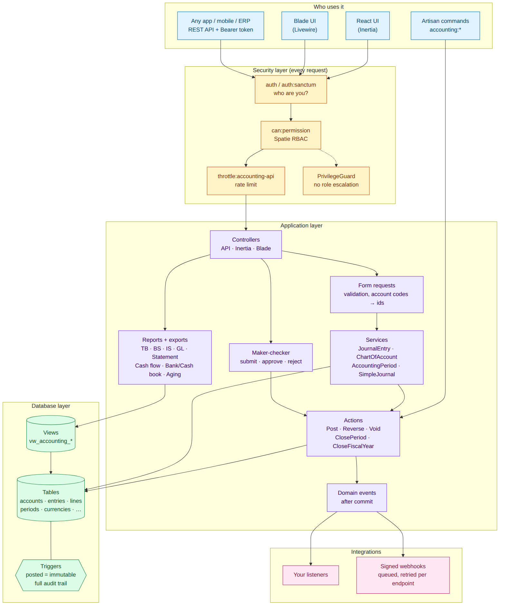
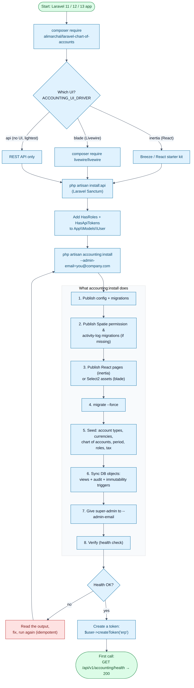
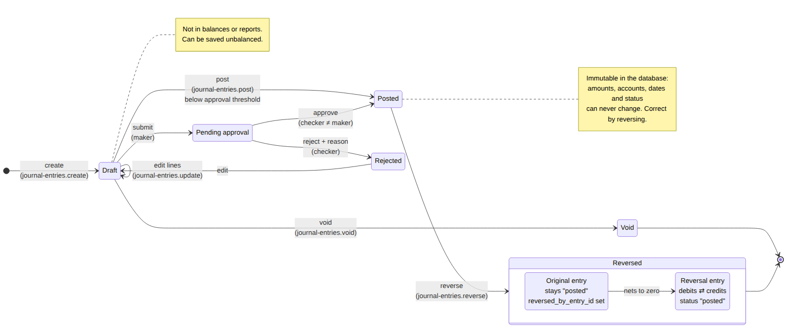
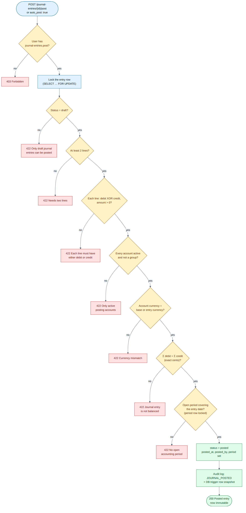
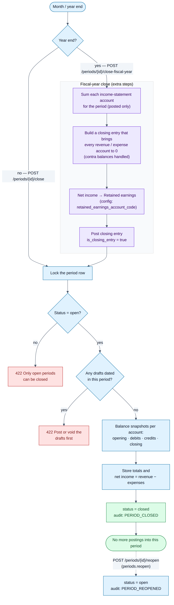
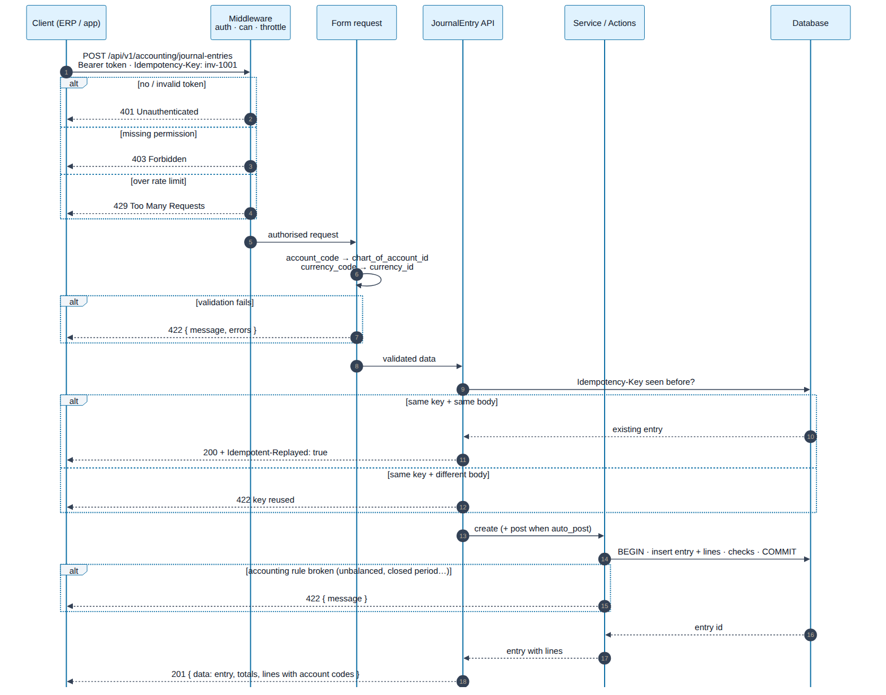
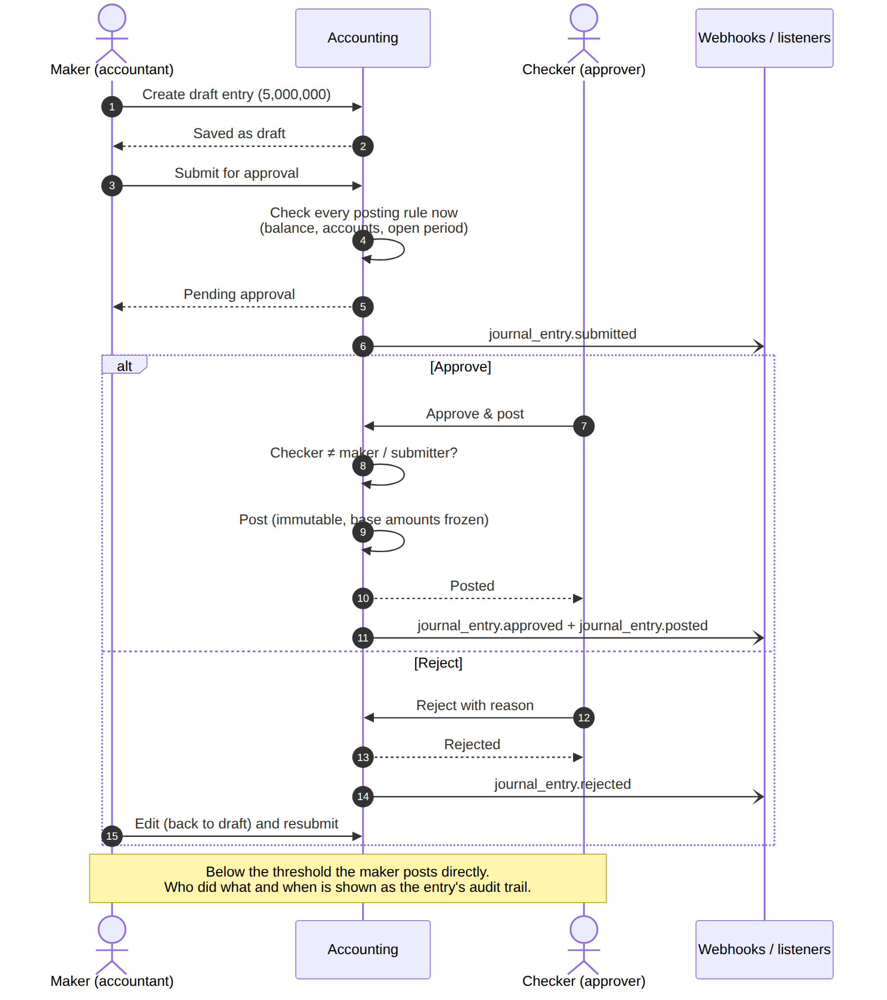
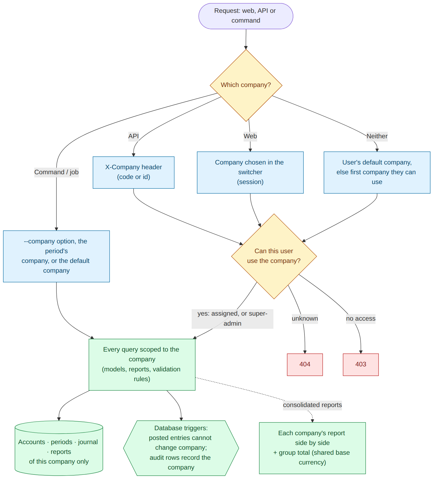

# Laravel Chart of Accounts

[](https://packagist.org/packages/alimarchal/laravel-chart-of-accounts)
[](https://packagist.org/packages/alimarchal/laravel-chart-of-accounts)
[](https://packagist.org/packages/alimarchal/laravel-chart-of-accounts)
[](https://packagist.org/packages/alimarchal/laravel-chart-of-accounts)

> **Chart of Accounts and double-entry accounting module for Laravel.**
> One-command install. Works with Jetstream (Blade/Livewire) and Breeze (Inertia/React).
>
> **Author:** Ali Raza Marchal — [kh.marchal@gmail.com](mailto:kh.marchal@gmail.com)
> **Package:** [alimarchal/laravel-chart-of-accounts](https://packagist.org/packages/alimarchal/laravel-chart-of-accounts)
> **Source:** [github.com/alimarchal/laravel-chart-of-accounts-package](https://github.com/alimarchal/laravel-chart-of-accounts-package)

---

## Highlights

- **Double-entry journal** — draft → posted → reversed / void, balanced in **exact cents**
- **Multi-company** — any number of companies in one database, each with its own chart, periods, journal and reports; per-user access, a company switcher, and consolidated group reports
- **Tamper-proof ledger** — posted entries are **immutable at the database layer** (triggers on MySQL/MariaDB, PostgreSQL, SQLite), the chart-of-accounts rules (valid tree, locked used accounts, same-company lines, no posting to group accounts) are enforced there too, and every change is written to an audit log
- **Maker-checker approvals** — entries above a threshold need a second person to approve; nobody approves their own work
- **Roles with segregation of duties** — super-admin, admin, accountant (maker), approver (checker), auditor, viewer; `accounting:roles` audits the matrix
- **Multi-currency** — every line keeps its frozen base-currency amount; all reports are in the base currency
- **Voucher numbering** — JV, CPV, CRV, BPV, BRV (and your own types) with **gapless** numbers such as `JV-2026-00012`, issued at posting, restarting per fiscal year or month, locked in the database
- **Source documents** — every entry can name the invoice, bill or receipt it records (and link to your own `Invoice` / `Bill` model); a document can be **posted only once**, enforced by the database
- **Attachments** — scanned bills, receipts and contracts on every entry, stored privately, never removable once posted, duplicate-file warning, optional "evidence required above" amount
- **Recurring entries** — rent, subscriptions, depreciation and accruals on a daily-to-yearly schedule: generated as drafts or posted automatically, with catch-up, pause/resume, run-now and a full history
- **Industry chart templates** — trading, manufacturing, services, school, NGO and healthcare charts: start a company from one, or add an industry's accounts to the chart you have (existing accounts are never changed); add your own in config
- **Chart import & export** — bring your existing chart in from Excel or CSV with a line-by-line preview (new / updated / errors) before anything is saved; export it, edit it, import it back
- **Renumber & merge accounts** — give an account (and its sub-accounts) new codes, or fold a duplicate into another account with a posted transfer entry — the ledger history is never rewritten
- **Control accounts** — receivables, payables, inventory, payroll and tax control accounts that only their module may post to, with a manual-postings exception list
- **Professional PDFs** — reports on your letterhead (logo, filters, totals, page X of Y) and printable vouchers with amount in words, signature boxes and a DRAFT/VOID watermark; big Excel/PDF exports run in the background
- **Month-end & year-end close** — a close workspace with a checklist (drafts, approvals, trial balance, bank reconciliation, earlier periods), a closing-entry preview, monthly periods, and audited reopening
- **Financial statements by report lines** — map accounts to statement lines (Revenue, Cost of sales, Trade receivables, PPE …); balance sheet and income statement with gross / operating / net profit and comparatives; **indirect-method cash flow** that always reconciles to cash
- **12 reports** — trial balance, balance sheet, income statement, cash flow, general ledger, account statement (running balance), bank & cash book, aged AR/AP — export to CSV (streamed, any size), XLSX, PDF
- **REST API** (OpenAPI 3.1 + Postman), **React** (Inertia) and **Blade/Livewire** UIs — or API only
- **Events & signed webhooks** for every ledger action (posted, reversed, approved, period closed, …)
- **Proven at scale** — 400,000 journal lines: trial balance 0.77 s, account statement 0.1 s, 46 concurrent postings/s with zero imbalance ([performance report](docs/performance.md))
- **Tested** — 390+ Pest tests in CI on PHP 8.2–8.4, Laravel 11–13 (+ Laravel 14 dev), SQLite/MySQL/MariaDB/PostgreSQL; Larastan level 5

---

## How it works (visual guide)

> Every diagram is generated from the Mermaid sources in [`docs/diagrams/`](docs/diagrams) (SVG + PNG in [`docs/images/`](docs/images)).

### 1. Architecture — who calls what



### 2. Installation flow



### 3. Journal entry lifecycle



### 4. What happens when an entry is posted



\* The control-account check is skipped for reversals and year-end closing entries, which follow their source entry.

### 5. Month-end and year-end close



### 6. An API request, step by step



### 7. Maker-checker approval



### 8. Multi-company: which company a request works in



---

## Requirements

| | Supported |
|---|---|
| PHP | 8.2, 8.3, 8.4 (Laravel 13 needs ≥ 8.3) |
| Laravel | 11, 12, 13 — **Laravel 14** (expected Q1 2027, PHP ≥ 8.4) is tracked in CI against its dev branch and will be supported on release |
| Database | MySQL 8 · MariaDB 10.6+ · PostgreSQL 13+ · SQLite 3.35+ |
| React UI | Laravel React starter kit — Inertia 3 (current kit) or Inertia 2 (small `app.tsx` addition, see Installation) |
| Blade UI | Livewire 3 or 4 |
| API auth | Laravel Sanctum (or any guard via `ACCOUNTING_API_MIDDLEWARE`) |

---

## Installation (5 minutes)

**1. Install the package**

```bash
composer require alimarchal/laravel-chart-of-accounts
php artisan install:api            # Sanctum, for the REST API (skip if already installed)
```

**2. Add two traits to `app/Models/User.php`**

```php
use Laravel\Sanctum\HasApiTokens;
use Spatie\Permission\Traits\HasRoles;

class User extends Authenticatable
{
    use HasApiTokens, HasFactory, HasRoles, Notifiable;
}
```

**3. Run the installer**

```bash
php artisan accounting:install --admin-email=you@example.com
```

That's it — open `/accounting`. The installer is idempotent (safe to re-run) and takes about two seconds. It
publishes config and migrations, migrates, seeds a ready-to-use chart of accounts, currencies, the current
fiscal year, roles and tax codes, creates the database views and triggers, gives `super-admin` to your user,
and verifies everything. If a trait is missing it prints the exact lines to add.

**Choose your UI** (in `.env`, before step 3):

| `ACCOUNTING_UI_DRIVER` | You get | Notes |
|---|---|---|
| `inertia` (default) | React pages in `resources/js/pages/accounting` | Run `npm run build` afterwards |
| `blade` | Blade + Livewire pages | `composer require livewire/livewire` |
| `api` | REST API only | Lightest: no web routes, views or Livewire |

<details>
<summary><b>React: add the menu link and (older starter kits) the layout</b></summary>

Add Accounting to `resources/js/components/app-sidebar.tsx`:

```tsx
import { Calculator } from 'lucide-react';

const mainNavItems: NavItem[] = [
    { title: 'Dashboard', href: dashboard(), icon: LayoutGrid },
    { title: 'Accounting', href: '/accounting', icon: Calculator },
];
```

The pages declare their breadcrumbs with `Page.layout = { breadcrumbs }`. The current starter kit
(**Inertia 3**) wraps them in the app layout automatically. Starter kits on **Inertia 2** need this
`resolve` in `resources/js/app.tsx` (tested with the February 2025 kit):

```tsx
import type { ReactNode } from 'react';
import AppLayout from './layouts/app-layout';
import type { BreadcrumbItem } from './types';

createInertiaApp({
    resolve: (name) =>
        resolvePageComponent(`./pages/${name}.tsx`, import.meta.glob('./pages/**/*.tsx')).then((module) => {
            const page = (module as { default: { layout?: unknown } }).default;
            const options = page.layout as { breadcrumbs?: BreadcrumbItem[] } | undefined;

            if (name.startsWith('accounting/') && typeof options !== 'function') {
                page.layout = (child: ReactNode) => <AppLayout breadcrumbs={options?.breadcrumbs}>{child}</AppLayout>;
            }

            return module;
        }),
    // ...
});
```
</details>

<details>
<summary><b>Optional settings</b></summary>

```env
ACCOUNTING_BASE_CURRENCY=USD            # default PKR; set before installing
ACCOUNTING_CHART_PRESET=general         # or "school"
ACCOUNTING_ROUTE_PREFIX=accounting      # URL prefix for the web UI
ACCOUNTING_MULTI_COMPANY=true           # several companies (see below)
ACCOUNTING_APPROVALS_ENABLED=true       # maker-checker (see below)
ACCOUNTING_APPROVAL_THRESHOLD=100000    # in base currency; 0 = every entry
ACCOUNTING_WEBHOOK_URLS=https://erp.example.com/hooks/accounting
ACCOUNTING_WEBHOOK_SECRET=change-me
```
</details>

---

## API quick start

```bash
# A token for an existing user (or issue tokens from your own login endpoint)
php artisan tinker --execute="echo App\Models\User::first()->createToken('erp')->plainTextToken;"
```

```bash
TOKEN=1|xxxxxxxx
API=http://localhost:8000/api/v1/accounting
H=(-H "Accept: application/json" -H "Authorization: Bearer $TOKEN" -H "Content-Type: application/json")

# Is everything installed?
curl "${H[@]}" $API/health

# Easiest possible entry: debit one account, credit another (posts immediately)
curl "${H[@]}" -X POST $API/journal-entries/simple \
  -H "Idempotency-Key: rent-2026-10" \
  -d '{"debit_account_code":"5102","credit_account_code":"1101","amount":2500,"description":"Office rent"}'

# Multi-line entry using account codes — no ids needed
curl "${H[@]}" -X POST $API/journal-entries -d '{
  "entry_date": "2026-10-04", "reference": "INV-1001", "auto_post": true,
  "lines": [
    {"account_code": "1103", "debit": 1500, "credit": 0, "cost_center_code": "ADMIN"},
    {"account_code": "4101", "debit": 0, "credit": 1500}
  ]}'

# Balances and reports
curl "${H[@]}" "$API/chart-of-accounts/tree"
curl "${H[@]}" "$API/reports/trial-balance"
curl "${H[@]}" "$API/reports/income-statement?date_from=2026-01-01&date_to=2026-12-31"
curl "${H[@]}" "$API/reports/balance-sheet?as_of_date=2026-12-31"
```

* **Full reference:** [`docs/openapi.yaml`](docs/openapi.yaml) (OpenAPI 3.1 — open it in Swagger UI, Redoc, Stoplight, or import into Insomnia).
* **Postman:** import [`docs/postman_collection.json`](docs/postman_collection.json), set the `host` and `token` variables, send.
* **Retries are safe:** send an `Idempotency-Key` header when creating entries — a retry returns the original entry (`200`, `Idempotent-Replayed: true`) instead of posting twice.
* **Errors are predictable:** `401` no token · `403` missing permission · `404` not found · `422` validation (`errors`) or accounting rule (`message`) · `429` rate limit.

---

## Upgrading

After `composer update alimarchal/laravel-chart-of-accounts`:

```bash
php artisan accounting:update
```

Refreshes package-owned files (React pages / Select2 assets), runs new migrations (`--force`), re-syncs the
database views and triggers, and adds roles/permissions introduced by the new version (your changes to
existing roles are kept). It never overwrites your `config/accounting.php` or customised views
(`--views` re-publishes Blade views explicitly).

---

## Route Configuration

By default the package uses the `/accounting/` URL prefix. To change it:

```env
# .env
ACCOUNTING_ROUTE_PREFIX=settings        # URLs: /settings/journal-entries, /settings/reports/...
ACCOUNTING_ROUTE_NAME_PREFIX=accounting # Route names stay: accounting.dashboard, accounting.journal-entries.index
```

> Route **names** stay as `accounting.*` regardless of the URL prefix, so views and redirects work without changes.

**Settings-style routes example** (used in our demo):

| URL | Route Name |
|-----|-----------|
| `/settings` | `accounting.dashboard` |
| `/settings/journal-entries` | `accounting.journal-entries.index` |
| `/settings/reports/general-ledger` | `accounting.reports.general-ledger` |
| `/settings/chart-of-accounts` | `accounting.chart-of-accounts.index` |
| `/settings/periods` | `accounting.periods.index` |
| `/settings/users` | `settings.users.index` |
| `/settings/roles` | `settings.roles.index` |
| `/settings/permissions` | `settings.permissions.index` |

---

## Creating Journal Entries — Three Ways

### 1. Static Helper — `JournalEntry::record()`

The fastest way to create a balanced GL entry programmatically:

```php
use Alimarchal\LaravelChartOfAccounts\Models\JournalEntry;

// Create a draft entry
$entry = JournalEntry::record(
    description: 'Office rent payment',
    debitAccountCode: '5102',   // Rent Expense
    creditAccountCode: '1101',  // Cash In Hand
    amount: '150000.00',        // strings avoid float rounding
    post: false,                // save as draft
);

// Create and post immediately
$entry = JournalEntry::record(
    description: 'Salary payment — June 2026',
    debitAccountCode: '5101',   // Salary Expense
    creditAccountCode: '1108',  // Operating Bank Account
    amount: 500000,
    post: true,                 // post immediately
    reference: 'SAL-2026-06',
);

echo $entry->status;      // 'posted'
echo $entry->reference;   // 'SAL-2026-06'
echo $entry->id;          // auto-assigned ID
```

**Parameters:**

| Parameter | Type | Required | Description |
|-----------|------|----------|-------------|
| `description` | `string` | Yes | Human-readable transaction description |
| `debitAccountCode` | `string` | Yes | Account code for the debit line (e.g. `'5101'`) |
| `creditAccountCode` | `string` | Yes | Account code for the credit line (e.g. `'1101'`) |
| `amount` | `float\|int\|string` | Yes | Amount — same value debited AND credited (rounded to cents) |
| `post` | `bool` | No | `true` = post immediately, `false` = draft (default) |
| `reference` | `string\|null` | No | Optional voucher/invoice reference number |

**What it does automatically:**
- Resolves account codes to IDs via `ChartOfAccount`
- Finds active base currency
- Finds currently open accounting period
- Creates entry header + two perfectly balanced lines
- Optionally posts via `JournalEntryService::post()`
- Wraps in a DB transaction

**Returns:** Fresh `JournalEntry` model.
**Throws:** `ModelNotFoundException` if an account code or an open period for today is not found;
`AccountingException` if posting violates a rule (unbalanced, group/inactive account, closed period).

> `JournalEntry::record()` posts as the current user without a permission check — it is a server-side API.
> Authorize the caller yourself (e.g. `Gate::authorize('journal-entries.post')`) when exposing it to users.

---

### 2. REST API

**Create a draft entry:**
```http
POST /api/v1/accounting/journal-entries
Authorization: Bearer {token}
Content-Type: application/json

{
  "entry_date": "2026-06-04",
  "accounting_period_id": 1,
  "currency_id": 1,
  "fx_rate_to_base": 1,
  "reference": "SAL-2026-06",
  "description": "Salary payment June 2026",
  "lines": [
    { "chart_of_account_id": 42, "debit": 500000, "credit": 0, "description": "Salaries Expense" },
    { "chart_of_account_id": 11, "debit": 0, "credit": 500000, "description": "Cash" }
  ]
}
```

**Post entry:**
```http
POST /api/v1/accounting/journal-entries/{id}/post
Authorization: Bearer {token}
```

**Reverse entry** (`reversal_date` optional, defaults to today, cannot precede the original):
```http
POST /api/v1/accounting/journal-entries/{id}/reverse
Authorization: Bearer {token}
Content-Type: application/json

{ "description": "Reversal of SAL-2026-06", "reversal_date": "2026-06-30" }
```

`auto_post: true` on create/update additionally requires the `journal-entries.post` permission.

**Errors:** validation failures return `422` with `errors`; accounting rule violations (unbalanced entry,
closed period, already reversed, account in use, …) return `422` with a `message`.

**Void entry:**
```http
POST /api/v1/accounting/journal-entries/{id}/void
Authorization: Bearer {token}
```

**List with filters:**
```http
GET /api/v1/accounting/journal-entries?filter[status]=posted&filter[entry_date_from]=2026-06-01&sort=-entry_date
```

---

### 3. Web UI (Blade/Livewire)

Visit `/settings/journal-entries/create` (or `/accounting/journal-entries/create`).

**UI features:**
- All account and cost center dropdowns use **Select2** with search
- Real-time balance status badge (green = balanced, red = not balanced)
- **Save Draft button is disabled until debits = credits** — prevents unbalanced saves
- Live debit/credit totals update as you type

---

## Recurring entries

Dashboard → **Recurring Entries** (React and Blade) or `/api/v1/accounting/recurring-entries`. A template holds a balanced
set of lines and a schedule; the scheduler turns it into journal entries.

- **Schedule**: daily, weekly, monthly, quarterly or yearly, every *N* periods, from a first date, optionally until an
  end date or after *N* entries. Monthly dates keep their day and are clamped in short months (the 31st becomes
  the 28th in February, then returns to the 31st).
- **Each entry is** created as a **draft**, or **posted automatically**. Posting runs as the template's creator: if they
  may post, it posts; under maker-checker it is **submitted for approval**; a closed period, a control account or a
  creator without posting rights leaves it a **draft with the reason** on the run. The schedule moves on either way.
- **Runs are logged** (one per scheduled date, enforced by a unique index, so two schedulers cannot duplicate an
  occurrence). An entry that cannot even be created stops the template at that date and is retried next time.
- **Catch-up**: if the scheduler was off, the missed occurrences are generated (dated on their scheduled days), up to
  `ACCOUNTING_RECURRING_MAX_CATCH_UP` (12) per run. A paused template skips what it missed when resumed (or generates it).
- **Generate now** makes the next occurrence immediately; **pause / resume**; templates that have generated entries are
  paused, not deleted. Amounts are in the base currency.

```bash
php artisan accounting:run-recurring              # generate what is due (every company)
php artisan accounting:run-recurring --dry-run    # list what is due
php artisan accounting:run-recurring --date=2026-12-31 --company=SUB
```

The package schedules the command daily at `ACCOUNTING_RECURRING_TIME` (02:00) — your app needs the Laravel scheduler
(`* * * * * php artisan schedule:run`); `ACCOUNTING_RECURRING_SCHEDULE=false` leaves scheduling to you. Permissions
`recurring-entries.view / create / update / delete / run` (accountant: all; approver, auditor, viewer: view).

## Tax

Dashboard → **Tax** (React and Blade) or `/api/v1/accounting/tax/…`. Tax codes and their dated rates (Accounting →
Tax codes) drive a tax ledger and tax returns.

- **Tax codes** now have a **kind** — *output* (collected on sales), *input* (paid on purchases), *withheld* (deducted from
  payments we make) or *advance* (deducted from payments to us) — the **tax account** the tax is booked to, and a
  jurisdiction. A rate is picked by date: the active rate with the latest start on or before the document's date.
- **Calculator**: base, tax and total for an amount, tax-exclusive or inclusive, rounded to the cent (an inclusive amount
  always splits exactly: base + tax = amount).
- **Taxed documents**: *Tax → New taxed document* books an invoice, bill, credit or debit note, or a payment / receipt with
  tax withheld in one go — the tax is worked out and booked to the code's tax account, with a live preview. In the API and
  in any journal entry a line may carry `tax_code_id` (and `tax_inclusive`): it is split into the taxable amount and a tax
  line on the same side. Both lines are **marked** (`tax_role` base / tax), which is what the reports read; zero-rated and
  exempt sales keep only the marked base.
- **Tax report**: per tax code the taxable base, the tax and the number of documents for any period, from posted entries
  in the base currency (credit notes and returns reduce them), with the documents behind it, and CSV / XLSX / PDF export.
  Totals: output tax, input tax, **net payable**, tax withheld by us, advance tax.
- **Tax return**: *File a return* settles a period in one entry dated at its end — output tax debited and input tax credited
  on their tax accounts, the difference on the payable account you pick (a refund debits it). Periods cannot overlap; a
  return can be **voided** (its entry is reversed and the period can be filed again). Audited (`TAX_RETURN_*`).
- Editing a draft keeps its tax markers (send `tax_code_id`, `tax_role` and `tax_rate` back with the lines). Withholding
  you remit, or advance tax you claim, is an ordinary payment / entry on the withholding account.

Permissions `tax-returns.view` (accountant, approver, auditor, viewer), `tax-returns.file` and `tax-entries.create`
(accountant); the calculator needs `tax-codes.view`.

## Budgets

Dashboard → **Budgets** (React and Blade) or `/api/v1/accounting/budgets`. A budget plans income and expenses by
**account** (optionally **cost center**) and **month**, in the base currency and the account's natural direction (income
earned, expense spent), and is then followed against the ledger.

- **Plan**: a first and last month (up to 24 months) and one line per account — an *annual* figure that is spread
  evenly (the odd cents land in the first months) or amounts *by month*. **Build from last year**: add every account that
  had income or expenses in the same months a year earlier, raised or lowered by a percentage. **Copy** a budget to a later
  year with a percentage change.
- **Workflow**: *draft* (editable) → *approved* (needs `budgets.approve` — the accountant plans, the approver approves) →
  *closed*; reopen to revise. Only one approved budget may cover a month.
- **Budget against actual**: for the whole budget or any range of months, and for one cost center. Actuals are posted
  entries in base currency (closing entries excluded). Per account: budget, actual, **variance** (favourable when
  positive: income above plan, expenses below it), share used and a status — *ok*, *warning* (an expense at
  `ACCOUNTING_BUDGET_WARN_PERCENT`, 90%, of its budget), *over*, *behind* (income below plan), *unbudgeted* (spending with
  no budget line); click a row for the months. Totals for income, expenses and net. Export to CSV, XLSX and PDF.
- **Optional control**: `ACCOUNTING_BUDGET_CONTROL=block` refuses to post an entry that takes a budgeted expense account
  past its **cumulative** budget (the sum of its monthly budgets up to the entry's month) in the approved budget covering
  the date. Unbudgeted accounts, income, drafts and system entries are never blocked; users with `budgets.override` may
  post anyway. The default is `off`.

Permissions `budgets.view` (accountant, approver, auditor, viewer), `budgets.create / update / delete` (accountant),
`budgets.approve` (approver) and `budgets.override` (administrators). Audited (`BUDGET_*`).

## Bank statements

Dashboard → **Bank Statements** (React and Blade) or `/api/v1/accounting/bank-statements`. Import the statement your bank
gives you, match it to the ledger and reconcile — no retyping.

- **Import** a CSV or Excel file for a bank account (one linked to a chart of accounts account). Columns are recognised
  by name: *Date* (Transaction / Value / Posting Date), *Description* (Narration, Particulars, Details …), *Reference*
  (Cheque No, Ref No …), *Withdrawal / Debit* and *Deposit / Credit* — or one signed *Amount* — and *Balance*. Dates
  as `2026-10-05`, `05/10/2026` (`ACCOUNTING_BANK_DATE_ORDER=mdy` for US order), `5-Oct-2026` or Excel serials; amounts
  as `1,234.50`, `(120.00)`, `-45`, `500.00 DR`, `1.234,56`. A preview lists every row first; a file with an error
  imports nothing.
- **No duplicates**: each transaction is fingerprinted (account, date, amount, reference, description and its n-th
  occurrence in the file), so importing an overlapping statement again brings in only what is new, while two identical
  charges on one day both come in. The fingerprint is unique in the database.
- **Matching**: a transaction matches a posted, unreconciled ledger line on the bank's account with the same amount, dated
  within `ACCOUNTING_BANK_MATCH_DAYS` (5) days. **Auto-match** takes every transaction with exactly one candidate (and
  whose candidate nobody else wants); the rest you match by hand from the list of candidates. A ledger line serves one
  transaction. Matched ledger lines are marked *cleared*.
- **Book it**: for a transaction not in the books yet (bank charges, interest, a direct deposit) pick the other account:
  a deposit debits the bank and credits it, a withdrawal the reverse; the entry is posted when possible, otherwise left
  as a draft (closed period, approval, evidence required) and still linked. Or **ignore** it.
- **Reconcile** once every transaction is matched, booked or ignored (and the closing balance — read from the file's last
  balance, or typed — is known): the matched ledger lines become *reconciled* in a bank reconciliation dated at the
  statement's end. A reconciled statement is locked; deleting an unreconciled one releases its matches.

Permissions `bank-statements.view` (accountant, approver, auditor, viewer), `bank-statements.import` and
`bank-statements.match` (accountant). Audited (`BANK_STATEMENT_*`).

## Currency revaluation

Dashboard → **Currency Revaluation** (React and Blade) or `/api/v1/accounting/fx-revaluation`. An asset or liability
account whose currency is not the base currency (a USD bank account, a EUR payable, …) holds a **foreign balance**
(what its lines say in that currency) and a **carrying value** in the base currency (what the ledger booked at the
rates of the day). At period end the carrying value is restated to *foreign balance × closing rate*; the difference
is an **unrealised exchange gain or loss**.

- **Closing rates**: type them in, or keep a dated **rate history** (`/fx-revaluation/rates`): the latest rate on or before
  the date is used, else the currency's own rate. Calculate first — the preview lists every account with its foreign
  balance, rate, carrying value, revalued amount and adjustment; nothing is posted until you confirm.
- **One adjusting entry** in the base currency (voucher type JV, origin `fx-revaluation`): each account is debited or
  credited by its adjustment and the net goes to the **gain/loss account** you pick (any active income or expense account;
  `ACCOUNTING_FX_GAIN_LOSS_ACCOUNT` pre-selects one by code). Only posted entries up to the date count, and only lines
  in the account's own currency make up its foreign balance, so earlier adjustments never distort it.
- **Safe to repeat**: the carrying value already includes earlier adjustments, so running again at the same rates
  adjusts nothing ("Nothing to revalue"); a new rate adjusts only the difference.
- **Auto-reverse** (optional): a reversal dated after the revaluation (default: the next day, needs an open period) puts
  the books back on the original rates for the next period — the usual month-end routine. A revaluation can also be
  reversed later from its page. Each run keeps its per-account detail and is audited (`FX_REVALUATION_*`).

Permissions `fx-revaluation.view` (accountant, approver, auditor, viewer), `fx-revaluation.run` and
`fx-revaluation.rates` (accountant).

## Industry chart templates

Chart of Accounts → **Templates** (React and Blade), `GET /chart-templates`, or `php artisan accounting:chart-templates`.
A template is a base chart plus the accounts an industry adds:

| Template | Adds (examples) |
|---|---|
| `general` | The standard chart (the default) |
| `trading` | Merchandise and goods in transit, sales returns / discounts (contra income), purchases, purchase returns, freight inward, customs duty, sales commission |
| `manufacturing` | Work in progress, packing materials, spare parts, factory building, tools and dies, a **Manufacturing Overheads** group (rent, utilities, depreciation, indirect labour, wastage) and production variances |
| `services` | Unbilled revenue, retention payable, consulting / retainer / project income, subcontractor costs |
| `school` | The school chart (student fee receivable, fee incomes, books and uniform stock) plus hostel, annual charges and examination accounts |
| `ngo` | Restricted / unrestricted / endowment funds, grants and pledges receivable, donations, grant income, programme and fundraising costs |
| `healthcare` | Patient and insurance receivables, medical and pharmacy stock, consultation / laboratory / pharmacy / procedure income, doctors' fees |

- **Preview first**: every account is listed as *new*, *already there*, *named differently* (your name is kept) or
  *blocked* (missing parent).
- **Safe on a chart in use**: only missing accounts are added, parents first; nothing existing is renamed, moved or
  re-typed, so a template can be applied again later or on top of another one. Contra accounts get the opposite
  side, and every new account is mapped to its **statement line** (see Report mapping) so the statements stay complete.
- **New companies** can start from one: `php artisan accounting:create-company SUB "Clinic" --template=healthcare`.
- Permission `chart-templates.apply` (super-admin); audited as `CHART_TEMPLATE_APPLIED`.

```php
// config/accounting.php — your own template
'chart_templates' => [
    'bakery' => ['name' => 'Bakery', 'description' => 'Bread and cakes', 'base' => 'general',
        'extras' => [['5121', '5100', 'EXPENSE', 'Flour and Ingredients', false, ['line' => 'IS-COST-OF-SALES']]]],
],
```

```bash
php artisan accounting:chart-templates                       # list
php artisan accounting:chart-templates ngo --dry-run          # what it would add
php artisan accounting:chart-templates ngo --company=SUB      # add it to a company
```

## Importing and exporting the chart

Bring an existing chart of accounts in from **Excel (.xlsx) or CSV** — Chart of Accounts → **Import**
(React and Blade), or `POST /api/v1/accounting/chart-of-accounts/import`.

1. Download the **template** (or **export** the current chart — the export is in the same layout).
2. Fill in or edit the rows and upload the file.
3. The **preview** lists every line as *new*, *updated* (old → new for each field), *unchanged* or *error*,
   with the reason. Nothing is saved yet.
4. **Import** applies the whole file in one transaction. If any row is in error, nothing is imported.

| Column | Required | Notes |
|---|---|---|
| `account_code` | always | identifies the account; an existing code is updated (or left alone with "Leave them unchanged") |
| `account_name` | new accounts | |
| `parent_code` | no | an existing account or another row — parents may come **after** their children in the file |
| `account_type` | top-level new accounts | type code or name (`ASSET`, `Expense` …); children default to their parent's type |
| `normal_balance` | no | `debit` / `credit`; defaults to the type's |
| `currency` | no | currency code; defaults to the parent's, then the base currency |
| `is_group`, `is_active` | no | yes / no / 1 / 0 / true / false |
| `control_type` | no | `receivables`, `payables` … (needs `control-accounts.manage`) |
| `description` | no | |

Blank cells keep an existing account's value. Common header names are understood (`Code`, `Name`, `Parent`,
`Type` …), CSVs may use commas, semicolons or tabs, and Excel / Windows-1252 files are read as UTF-8. Every row
passes the same rules as the screens and the API **and the database guards** — a used account cannot change
type, a posting account cannot get children, loops are refused. The import is audited (`CHART_IMPORTED`, with
the codes created and updated), and needs the `chart-of-accounts.import` permission (super-admin by default).
Limits: `ACCOUNTING_CHART_IMPORT_MAX_KB` (5 MB) and `ACCOUNTING_CHART_IMPORT_MAX_ROWS` (5,000).

```bash
# Preview over the API, then import
curl -H "Authorization: Bearer $TOKEN" -F file=@chart.xlsx -F dry_run=1 $APP/api/v1/accounting/chart-of-accounts/import
curl -H "Authorization: Bearer $TOKEN" -F file=@chart.xlsx $APP/api/v1/accounting/chart-of-accounts/import
```

## Renumbering and merging accounts

Chart of Accounts → the ⇄ icon on an account (React and Blade), or the API. Needs `chart-of-accounts.restructure`
(super-admin by default). Both show a preview first and are audited.

**Renumber** — give an account a new code, even if it has journal entries (lines point to the account, not its
code, so every report follows). A group can take its sub-accounts along: codes sharing the group's prefix
(the code without trailing zeros) get the new prefix — `5100 → 6100` turns `5101` into `6101` and `5110` into
`6110`. To take its sub-accounts along, the new code keeps the group's length and trailing zeros (`7000 → 8000`,
not `7000 → 7700`); otherwise renumber the account alone. Codes already in use are refused, and so are accounts named in `config('accounting.defaults')` (change
the configured code first).

**Merge** — for duplicates (`Stationery` and `Stationary`). Posted entries are immutable, so nothing is rewritten:

1. The source's balance moves to the target with a **posted transfer entry**, one pair of lines per cost center,
   through the normal rules (open period, maker-checker approval, control accounts). If the transfer needs
   approval, the merge is refused: post the transfer through approvals first, then merge (the balance is zero).
2. Draft lines, sub-accounts and bank accounts that used the source now use the target.
3. The source is **deactivated** with `metadata.merged_into`; its history stays in every report.

Only accounts of the same type, normal balance, currency and control type merge; entries waiting for approval
on the source must be decided first; configured and system accounts cannot be merged away.

```bash
curl -X POST -H "Authorization: Bearer $TOKEN" -d account_code=6100 $APP/api/v1/accounting/chart-of-accounts/59/renumber
curl -H "Authorization: Bearer $TOKEN" "$APP/api/v1/accounting/chart-of-accounts/120/merge-preview?target_account_id=67"
curl -X POST -H "Authorization: Bearer $TOKEN" -d target_code=5104 $APP/api/v1/accounting/chart-of-accounts/120/merge
```

## Voucher numbering

Every journal entry has a **voucher type**; when it is **posted** it gets the next number of that type's series.

| Code | Voucher | Typical use |
|------|---------|-------------|
| `JV` | Journal Voucher (default) | Adjustments, accruals, transfers; reversals and closing entries of untyped entries |
| `CPV` / `CRV` | Cash Payment / Cash Receipt Voucher | Cash paid / received |
| `BPV` / `BRV` | Bank Payment / Bank Receipt Voucher | Cheques and transfers out / in |

- **Gapless, in posting order.** The number is taken inside the posting transaction under a row lock, so two
  users posting at once never get the same number, and a failed posting gives its number back. Drafts have
  no number, so a voided draft never leaves a gap (auditors check exactly this).
- **Format** per type, default `{PREFIX}-{FY}-{SEQ:5}` → `JV-2026-00012`. Tokens: `{PREFIX}`, `{FY}` (`2026`, or
  `2025-26` for a July–June year), `{YYYY}`, `{YY}`, `{MM}`, `{SEQ}` / `{SEQ:n}`.
- **Restarts** every fiscal year (default), every month (format needs `{MM}` and a year), or never.
- **Locked:** the database refuses to change a posted entry's voucher number or type. A type with numbered
  entries keeps its code and restart rule (name, prefix and format may change; new numbers use them).
  The default type `JV` cannot be deleted or deactivated; other used types can only be deactivated.
- A **reversal** is numbered in the series of the entry it reverses (`BRV-2026-00002` reverses `BRV-2026-00001`).
- Choose the type in the journal form (React and Blade), or send `voucher_type_code` / `voucher_type_id` to the API.
  Manage types under **Accounting → Voucher Types** (`voucher-types.*`; admin manages, everyone else views).
- Upgrading numbers the entries already posted as `JV`, in posting order, and continues the series from there.

```php
$entry = JournalEntry::query()->find($id);
$entry->voucher_number;          // "CPV-2026-00007" (null while draft)
$entry->voucherType->name;       // "Cash Payment Voucher"
app(VoucherNumberService::class)->preview($type, '2026-11-01');   // next number, not reserved
```

---

## Source documents

An entry can say which document it records — a sales invoice, purchase bill, receipt, payment voucher,
credit/debit note, expense claim, payroll sheet, bank statement, contract or other (`config('accounting.source_documents.types')`)
— with its number and date, and can be linked to the application model it came from.

- **No double posting.** A document (type + number, case-insensitive) can be posted only once per company. The second
  posting is refused: *"Purchase bill BILL-778 is already posted as JV-2026-00012. Reverse that entry first, or correct
  the document number."* A unique database index backs this up, so two users posting the same bill at the same moment
  cannot both succeed. Drafts with the same number can still be saved. Turn it off with
  `ACCOUNTING_PREVENT_DUPLICATE_DOCUMENTS=false`.
- **Reversal frees the document**: the reversal records the same document (and link) but never holds it, so a
  corrected entry can be posted for the same bill.
- **Locked after posting**: the database refuses to change the document type, number, date or link of a posted entry.
- Shown in the journal form (React and Blade), the entry page, the journal list (filter *Document no.*) and the
  general ledger (voucher number and document number on every line, exports included).
- API: `source_document_type`, `source_document_number`, `source_document_date` on `POST /journal-entries` and
  `/journal-entries/simple`; responses carry `source_document`; filters `filter[source_document_number]`, `filter[source_document_type]`.

Link entries to your own models:

```php
use Alimarchal\LaravelChartOfAccounts\Concerns\HasJournalEntries;

class Invoice extends Model
{
    use HasJournalEntries;
}

JournalEntry::record("Invoice {$invoice->number}", '1103', '4101', $invoice->total, post: true,
    source: $invoice, documentType: 'invoice', documentNumber: $invoice->number);

$invoice->journalEntries;          // every entry for the invoice, reversals included
$invoice->postedJournalEntry();    // the posted entry that currently holds it
JournalEntry::forSource($invoice)->get();
```

`JournalEntryService::create()` takes the same `source_document_*` keys and `'source' => $invoice`.

---

## Control accounts

A control account summarises a sub-ledger — customers (Accounts Receivable), suppliers (Accounts Payable), stock,
fixed assets, payroll or tax. Its balance must always equal the sub-ledger, so **only entries of that module may post
to it**. A manual journal entry (UI or API) touching a control account is refused:

> Account 1103 Accounts Receivable is the control account for accounts receivable (customers): post through that
> module, or ask a controller with the "control-accounts.post-manual" permission.

- **Setting up:** open **Accounting → Control Accounts** and click **Recommended setup** (marks 1103 → receivables,
  2101 → payables, 1151–1153 → inventory, 2103 → payroll, 1107/2104 → tax; `config('accounting.control_accounts.recommended')`),
  or mark any posting account yourself. Existing installs are **not** marked on upgrade, so nothing changes until you
  opt in. Changing control accounts needs `control-accounts.manage` (super-admin and admin).
- **Modules post with their name**: `JournalEntryService::create([... 'origin_module' => 'receivables'])` or
  `JournalEntry::record(..., module: 'receivables')`. The API never accepts a module, so API clients post as manual.
  The module of a posted entry is locked in the database.
- **Controller adjustments**: users with `control-accounts.post-manual` (super-admin only by default) may post manual
  entries to control accounts — under maker-checker both the submitter and the approver need it. Every such entry
  appears in the **Manual postings** column and list, which is the first thing an auditor reviews.
- Reversals and year-end closing entries follow the entry they come from and are never blocked.
- API: `GET /control-accounts` (balances and manual postings), `POST /control-accounts/recommended`,
  `GET /control-accounts/{id}/manual-postings`, `PUT /chart-of-accounts/{id}/control-type`; accounts carry `control_type`.

---

## Attachments (supporting documents)

Every journal entry can carry its evidence — the scanned bill, receipt, contract or bank advice. Use the
**Supporting documents** panel on the entry page (React and Blade) or the API.

- **Private storage**: files go to `ACCOUNTING_ATTACHMENTS_DISK` (default `local`, i.e. `storage/app/private`) under
  `accounting/{company}/{yyyy}/{mm}/{uuid}.ext` and are served only through the authorised download route
  (`attachments.view`, company-scoped). Paths never leave the server.
- **Limits**: `ACCOUNTING_ATTACHMENTS_MAX_KB` (default 10 MB) and `config('accounting.attachments.mimes')`
  (pdf, images, Office files, csv, txt, xml, zip).
- **Evidence is kept**: documents of posted or voided entries cannot be removed; drafts can lose them. Every upload
  and removal is in the audit trail (`ATTACHMENT_ADDED` / `ATTACHMENT_REMOVED`, with the SHA-256 of the file).
- **Duplicate warning**: a file that is already attached to another entry (same SHA-256) is flagged — the classic
  "same bill booked twice" check.
- **Evidence required above an amount**: `ACCOUNTING_ATTACHMENTS_REQUIRED_ABOVE=50000` makes entries of that total
  (base currency) or more need at least one document before they are posted or submitted for approval.
- Permissions: `attachments.view` (every role that sees the journal), `attachments.create` and `attachments.delete`
  (accountant). API: `GET/POST /journal-entries/{id}/attachments` (multipart `file`, `description`),
  `GET /attachments/{id}/download`, `DELETE /attachments/{id}`.

```php
app(AttachmentService::class)->attach($entry, $request->file('bill'), 'Supplier bill');
$entry->attachments;   // morphMany
```

---

## Multi-company

Run several companies (legal entities) from one installation. Each company has its **own chart of
accounts, periods, journal, cost centers, bank accounts, tax codes, reports and audit trail**; account
types and currencies are shared, and every company reports in the shared base currency.

```env
ACCOUNTING_MULTI_COMPANY=true      # off by default: a single-company install works exactly as before
```

Existing data is moved to the default company (`MAIN`) by the migration, so upgrading changes nothing
until you add a second company.

**Create a company** (chart of accounts, current fiscal year, cost centers and tax codes are created for it):

```bash
php artisan accounting:create-company SUB "Subsidiary Ltd" --fiscal-start=7 --user=accountant@example.com
```

…or in the React UI (**Accounting → Companies**, permission `companies.manage`), or with
`POST /api/v1/accounting/companies`. `--fiscal-start=7` gives a July–June fiscal year.

**Who sees what**

| | |
|---|---|
| Access | A user works only in companies they are given access to (Companies screen, `POST /companies/{id}/users`, or `--user`). `super-admin` works in all companies. Roles are the same in every company. |
| Web UI | A company switcher on the accounting dashboard (React) and above every Blade page. Add `<CompanySwitcher />` from `@/components/accounting/company-switcher` to your sidebar to show it everywhere. |
| API | Send `X-Company: SUB` (code or id). Without it the user's default company is used. Unknown company → `404`, no access → `403`. |
| Commands | `accounting:close-period {id}` and friends work in the company that owns the period; `--company=SUB` on `accounting:seed`, `verify`, `health-check`, `rebuild-snapshots`. |
| Isolation | Records of another company are never returned (`404` by id); ids and codes of another company are rejected in requests; a journal line can never use another company's account; a posted entry cannot be moved to another company (database trigger). |

**Consolidated reports** (`reports.consolidated.view`): trial balance, balance sheet and income statement
for several companies side by side with a group total — **Accounting → Consolidated Reports**, or
`GET /api/v1/accounting/reports/consolidated/{trial-balance|balance-sheet|income-statement}?companies=MAIN,SUB`.
Intercompany balances are not eliminated automatically; post elimination entries in a separate
consolidation company if you need them.

---

## Maker-checker approvals

Turn on four-eyes control for journal entries:

```env
ACCOUNTING_APPROVALS_ENABLED=true
ACCOUNTING_APPROVAL_THRESHOLD=100000   # base currency; entries below post directly. 0 = every entry
```


| Step | Who | Web UI | API |
|---|---|---|---|
| Record the draft | maker (`accountant`) | **Save** | `POST /journal-entries` |
| Submit | maker | **Submit for approval** | `POST /journal-entries/{id}/submit` |
| Approve → posts it | checker (`approver`) | **Approve & post** | `POST /journal-entries/{id}/approve` |
| or Reject with a reason | checker | **Reject** | `POST /journal-entries/{id}/reject` `{"reason": "…"}` |
| Fix and resubmit | maker | **Edit** → **Submit** | `PUT` then `submit` |

- The checker can never be the person who created or submitted the entry (not even `super-admin`) unless
  `ACCOUNTING_ALLOW_SELF_APPROVAL=true`.
- Posting an entry that needs approval directly is refused (`422`), from the UI, the API and `JournalEntry::record()`.
- All posting rules (balance, open period, active accounts) are checked at **submission**, so makers learn
  about problems before the checker sees the entry.
- Editing a rejected or pending entry sends it back to draft; it must be submitted again.
- The threshold is compared in the base currency (`amount × fx_rate_to_base`).
- Reversals and year-end closing entries are system-generated and are not held for approval.
- Every step is recorded (who + when) and shown as an **audit trail** on the entry page; the pending queue is
  `GET /journal-entries?filter[approval_status]=pending`.

---

## Events & webhooks

Every ledger action dispatches a Laravel event **after the database transaction commits** (listeners never see
rolled-back work):

| Event class | Webhook name |
|---|---|
| `JournalEntryPosted` | `journal_entry.posted` |
| `JournalEntryReversed` | `journal_entry.reversed` |
| `JournalEntryVoided` | `journal_entry.voided` |
| `JournalEntrySubmitted` / `Approved` / `Rejected` | `journal_entry.submitted` / `.approved` / `.rejected` |
| `AccountingPeriodClosed` / `Reopened` | `accounting_period.closed` / `.reopened` |

All live in `Alimarchal\LaravelChartOfAccounts\Events` and implement `AccountingEvent`, so one listener can catch them all:

```php
Event::listen(AccountingEvent::class, fn (AccountingEvent $e) => logger($e->name(), $e->payload()));
```

**Webhooks** — set `ACCOUNTING_WEBHOOK_URLS` (comma separated) and `ACCOUNTING_WEBHOOK_SECRET`. Each endpoint
gets its own queued job (retried with backoff 10 s → 1 h, `ACCOUNTING_WEBHOOK_TRIES`, default 5). Run a queue
worker in production; a receiver being down never fails the request that posted the entry.

```http
POST /hooks/accounting
X-Accounting-Event: journal_entry.posted
X-Accounting-Delivery: 0b6f…           # same on every retry of this delivery
X-Accounting-Signature: t=1791100000,v1=5d41…

{"id":"9c1e…","event":"journal_entry.posted","occurred_at":"2026-10-04T10:15:00Z","data":{"journal_entry":{"id":42,…}}}
```

Verify the signature on the receiving side (`id` is stable across retries — use it to de-duplicate):

```php
[$t, $v1] = array_map(fn ($p) => explode('=', $p, 2)[1], explode(',', $request->header('X-Accounting-Signature')));
$valid = hash_equals(hash_hmac('sha256', $t.'.'.$request->getContent(), config('services.accounting.secret')), $v1)
    && abs(time() - (int) $t) < 300;   // reject replays older than 5 minutes
```

---

## Multi-currency

Each journal entry has a currency and `fx_rate_to_base`. When it is posted, every line's **base-currency
amount** is calculated once and frozen (`base_debit` / `base_credit`, cents-exact: any rounding difference goes
to the largest line, so the entry still balances in the base currency). All reports, balances and the
approval threshold use these base amounts, so a later change of the exchange rate never changes history.

---

## Financial statements and report mapping

**Report Mapping** (dashboard → Report Mapping, `report-mapping.manage`) decides which statement line each account
reports under. Every company starts with a standard (IFRS-style) layout:

| Statement | Sections and standard lines |
|---|---|
| Balance sheet | **Current assets**: Cash and cash equivalents, Trade and other receivables, Inventories, Tax receivable · **Non-current assets**: Property, plant and equipment, Accumulated depreciation, Long-term investments · **Current liabilities**: Trade and other payables, Tax payable, Deferred income, Short-term borrowings · **Non-current liabilities**: Long-term borrowings · **Equity**: Share capital, Reserves, Retained earnings |
| Income statement | Revenue · Cost of sales · Other income · Operating expenses (Administrative, Depreciation, Other) · Finance costs · Income tax |

- **Map a group and everything under it follows**; an account can override its parent. Lines can be renamed,
  reordered and added (custom lines can be deleted once unused).
- **Apply recommended mapping** maps the seeded chart in one click (new installs and new companies are mapped
  automatically; existing accounts are never re-mapped).
- Each balance sheet line has a **cash-flow class** — cash, operating (working capital), non-cash adjustment,
  investing or financing — which an account can override.
- Accounts without a line are reported on an "unmapped" line of their section (and as unclassified cash flow),
  so the statements always add up; the screens say how many are left.

**Financial Statements** (`reports.financial-statements.view`): one screen with three tabs (React and Blade),
`GET /reports/statements/{balance-sheet|income-statement|cash-flow}`, and CSV / Excel / PDF exports
(`/reports/statement-balance-sheet/export/pdf` …).

- **Balance sheet** as of a date, optional comparative date; profit not yet closed shows in equity; totals and a
  difference check. Every line expands to its accounts.
- **Income statement** for a period, optional comparative period, with gross profit, operating profit, profit
  before tax and net profit.
- **Cash flow — indirect method**: profit for the period, non-cash adjustments (depreciation …), changes in
  working capital, investing and financing activities, then opening and closing cash. Year-end closing entries
  are left out, and because every entry balances, **opening cash + net change = closing cash** — any
  `difference` would point at a data problem.

## Reports & exports

| Report | Web | API | Notes |
|---|---|---|---|
| Trial balance | ✓ | `reports/trial-balance` | totals must be equal |
| Balance sheet | ✓ | `reports/balance-sheet` | `as_of_date` |
| Income statement | ✓ | `reports/income-statement` | `date_from`, `date_to` |
| Cash flow | ✓ | `reports/cash-flow` | direct method: cash & bank movements, period totals; paginated |
| General ledger | ✓ | `reports/general-ledger` | filter by account, dates, status; paginated |
| Account statement | ✓ | `reports/account-statement` | opening balance, **running balance**, closing balance; paginated |
| Bank book / cash book | ✓ | `reports/bank-book`, `cash-book` | |
| Aged receivables / payables | ✓ | `reports/aged-receivables`, `aged-payables` | 30/60/90 buckets |

Every report exports to **CSV, Excel (XLSX) and PDF** (`/accounting/reports/{report}/export/{csv|xlsx|pdf}`
and the same under the API, with the same filters; buttons on every React and Blade report). The permission is
checked before any data is read.

- **CSV** is streamed row by row, so it works for millions of lines.
- **PDF** is typeset with [dompdf](https://github.com/dompdf/dompdf) when installed (`composer require dompdf/dompdf`):
  company letterhead (logo, address, NTN), report title, the filters used, right-aligned amounts, debit/credit totals,
  "generated by … on …" and **Page X of Y**. Without dompdf a built-in renderer produces a plain PDF.
- **Big Excel/PDF exports run in the background.** Above `ACCOUNTING_EXPORT_MAX_XLSX_ROWS` (50,000) /
  `ACCOUNTING_EXPORT_MAX_PDF_ROWS` (2,000) rows the export is queued and shows up under **My Exports**
  (`/accounting/exports`), where only its owner can download it. The job re-checks the permission when it runs.
  Run a queue worker (`php artisan queue:work`) in production, and schedule `accounting:prune-exports` daily
  (keeps 7 days, `ACCOUNTING_EXPORTS_KEEP_DAYS`). `ACCOUNTING_QUEUE_LARGE_EXPORTS=false` refuses big exports with a
  `422` instead.

### Printing vouchers

Every journal entry prints as a voucher — **Print** (browser) and **PDF** buttons on the entry page, or
`/accounting/journal-entries/{id}/print` · `/pdf` · `GET /api/v1/accounting/journal-entries/{id}/pdf`:
voucher type and number, dates, source document, lines with cost centers, totals, **amount in words**
("PKR One Thousand Two Hundred Fifty and 50/100 Only", or Lakh/Crore with `ACCOUNTING_NUMBER_SYSTEM=south_asian`),
Prepared / Approved / Posted / Received signature boxes, and a DRAFT / VOID / REVERSED watermark.

```php
// config/accounting.php
'pdf' => [
    'engine' => env('ACCOUNTING_PDF_ENGINE', 'auto'),   // auto | dompdf | builtin
    'paper' => env('ACCOUNTING_PDF_PAPER', 'a4'),
    'logo' => env('ACCOUNTING_PDF_LOGO'),                // path on ACCOUNTING_PDF_LOGO_DISK; a company's own logo wins
    'number_system' => env('ACCOUNTING_NUMBER_SYSTEM', 'international'),   // or south_asian (Lakh, Crore)
],
```

**Performance** with 400,000 posted lines (PostgreSQL 16, 4 vCPU): trial balance 0.77 s, balance sheet 0.32 s,
general ledger page 0.09–0.38 s, account statement 0.11 s, 46 postings/s from 24 concurrent clients with zero
imbalance. Full numbers: [docs/performance.md](docs/performance.md).

---

## Full REST API Reference

Base URL: `/api/v1/accounting` — `ACCOUNTING_API_PREFIX`; middleware `ACCOUNTING_API_MIDDLEWARE` (default `api,auth:sanctum`)
plus `throttle:accounting-api` (`ACCOUNTING_API_RATE_LIMIT`, default 120/min per user). Every endpoint checks a permission.
Machine-readable spec: [`docs/openapi.yaml`](docs/openapi.yaml).

| Method | Endpoint | Description | Permission |
|--------|----------|-------------|------------|
| GET | `/health` | Installation health (503 if unhealthy) | `accounting.view` |
| GET/POST | `/journal-entries` | List (filters, sort, `include=lines`) / Create (+`auto_post`) | `journal-entries.view` / `.create` |
| POST | `/journal-entries/simple` | Two-line entry by account codes | `journal-entries.create` (+`.post`) |
| GET/PUT | `/journal-entries/{id}` | Show with lines / Update draft | `journal-entries.view` / `.update` |
| POST | `/journal-entries/{id}/post` | Post a draft | `journal-entries.post` |
| POST | `/journal-entries/{id}/reverse` | Reverse (optional `reversal_date`) | `journal-entries.reverse` |
| POST | `/journal-entries/{id}/void` | Void a draft | `journal-entries.void` |
| POST | `/journal-entries/{id}/submit` | Submit a draft for approval (maker-checker) | `journal-entries.create` |
| POST | `/journal-entries/{id}/approve` · `/reject` | Approve (posts it) / reject with `reason` | `journal-entries.approve` |
| GET/POST | `/journal-entries/{id}/attachments` | Supporting documents / attach one (multipart) | `attachments.view` / `.create` |
| GET | `/attachments/{id}/download` | Download a document | `attachments.view` |
| DELETE | `/attachments/{id}` | Remove a document of a draft | `attachments.delete` |
| GET | `/journal-entries/{id}/pdf` | Printable voucher PDF (needs dompdf, else 501) | `journal-entries.view` |
| GET | `/control-accounts` | Control accounts with balances and manual postings | `chart-of-accounts.view` |
| POST | `/control-accounts/recommended` | Mark the recommended control accounts | `control-accounts.manage` |
| GET | `/control-accounts/{id}/manual-postings` | Manual postings to a control account | `chart-of-accounts.view` |
| PUT | `/chart-of-accounts/{id}/control-type` | Set or clear an account's control type | `control-accounts.manage` |
| GET/POST | `/voucher-types` | Voucher types with their next numbers / Create | `voucher-types.view` / `.create` |
| GET/PUT/DELETE | `/voucher-types/{id}` | Show / Update / Delete an unused type | `voucher-types.*` |
| GET | `/voucher-types/{id}/next-number` | Preview the next number (`?date=`), nothing reserved | `voucher-types.view` |
| GET/POST | `/companies` | Companies you can use / Create a company | `accounting.view` / `companies.manage` |
| GET/PUT | `/companies/{id}` | Show (with members) / Update | `companies.manage` |
| POST/DELETE | `/companies/{id}/users[/{user}]` | Give / remove a user's access | `companies.manage` |
| GET/POST | `/users` | Users (`filter[name]`, `filter[email]`, `filter[role]`) / Create with roles | `user.view` / `user.create` |
| GET/PUT/DELETE | `/users/{id}` | Show (roles, direct and effective permissions) / Update / Delete | `user.view` / `.update` / `.delete` |
| PUT | `/users/{id}/roles` · `/users/{id}/permissions` | Replace roles / direct permissions (audited) | `user.assign-role` / `user.assign-permission` |
| GET/POST, GET/PUT/DELETE | `/roles`, `/roles/{id}` | Roles with counts / CRUD (super-admin protected) | `accounting.manage-settings` |
| GET | `/permissions` | All permissions grouped by area | `accounting.manage-settings` |
| GET | `/reports/statements/{balance-sheet\|income-statement\|cash-flow}` | Statements by report lines (`as_of_date`, `compare_as_of`, `date_from`, `date_to`, `compare_from`, `compare_to`) | `reports.financial-statements.view` |
| GET · POST | `/report-mapping` · `/report-mapping/recommended` | Lines and the mapping of every account / apply the recommended mapping | `report-mapping.manage` |
| PUT | `/chart-of-accounts/{id}/report-mapping` | Map an account to a line (`report_line_id`, `cash_flow_category`) | `report-mapping.manage` |
| POST · PUT · DELETE | `/report-lines` · `/report-lines/{id}` | Add / change / delete statement lines | `report-mapping.manage` |
| GET | `/reports/consolidated/{report}` | Group trial balance, balance sheet, income statement | `reports.consolidated.view` |
| GET/POST | `/chart-of-accounts` | List / Create | `chart-of-accounts.view` / `.create` |
| GET | `/chart-of-accounts/tree` | Whole chart as a tree | `chart-of-accounts.view` |
| GET/POST | `/recurring-entries` | Templates / create one (balanced lines + schedule) | `recurring-entries.view` / `.create` |
| GET/PUT/DELETE | `/recurring-entries/{id}` | Template with runs and upcoming dates / change / delete (only if it has not run) | `recurring-entries.*` |
| POST | `/recurring-entries/{id}/pause` · `/resume` · `/run` | Pause / resume (`skip_missed`) / generate the next entry now | `recurring-entries.update` / `.run` |
| POST | `/tax/calculate` | Tax on an amount (`tax_code_id`, `amount`, `inclusive`, `date`) | `tax-codes.view` |
| POST | `/tax/entries` | Book a taxed document (`type`, `amount`, `tax_code_id`, `account_id`, `counter_account_id`, `auto_post`) | `tax-entries.create` |
| GET | `/tax/returns/report` · `/tax/returns/report/export/{format}` | The tax ledger of a period / as a file | `tax-returns.view` |
| GET/POST | `/tax/returns` | Filed returns / file one (`period_from`, `period_to`, `payable_account_id`) | `tax-returns.view` / `.file` |
| GET/DELETE | `/tax/returns/{id}` | A return / void it (reverses its entry) | `tax-returns.view` / `.file` |
| GET/POST | `/budgets` | Budgets / create a draft (`lines` with `annual` or `amounts`, or `from_actuals`) | `budgets.view` / `.create` |
| GET/PUT/DELETE | `/budgets/{id}` | Budget against actual (`date_from`, `date_to`, `cost_center_id`) / change a draft / delete | `budgets.view` / `.update` / `.delete` |
| POST | `/budgets/{id}/approve` · `/close` · `/reopen` · `/copy` | Approve / close / reopen as a draft / copy (`name`, `start_date`, `uplift_percent`) | `budgets.approve` / `.update` / `.create` |
| GET | `/budgets/{id}/export/{csv\|xlsx\|pdf}` | Budget against actual as a file | `budgets.view` |
| GET | `/bank-statements` · `/bank-statements/{id}` | Statements / one with its transactions | `bank-statements.view` |
| POST | `/bank-statements/import` | Import a CSV/XLSX statement (`file`, `bank_account_id`, `dry_run`, `closing_balance`, `auto_match`) | `bank-statements.import` |
| PUT · DELETE | `/bank-statements/{id}` | Set the closing balance / delete (releases matches) | `bank-statements.match` |
| POST | `/bank-statements/{id}/auto-match` · `/reconcile` | Match unambiguous transactions / reconcile | `bank-statements.match` |
| GET | `/bank-statement-lines/{id}/candidates` | Ledger lines that could be the transaction | `bank-statements.view` |
| POST | `/bank-statement-lines/{id}/match` · `/unmatch` · `/ignore` · `/create-entry` | Match to a ledger line / release / ignore / book as an entry | `bank-statements.match` |
| GET/POST | `/fx-revaluation` | Revaluations and dated rates / post a revaluation (`as_of_date`, `gain_loss_account_id`, `rates`, `auto_reverse`) | `fx-revaluation.view` / `.run` |
| GET | `/fx-revaluation/preview` | What a revaluation at `as_of_date` (and optional `rates[currency]`) would adjust | `fx-revaluation.view` |
| GET | `/fx-revaluation/{id}` | A revaluation with its accounts | `fx-revaluation.view` |
| POST | `/fx-revaluation/{id}/reverse` | Reverse it (`reversal_date`, default the next day) | `fx-revaluation.run` |
| POST · DELETE | `/fx-revaluation/rates` · `/fx-revaluation/rates/{id}` | Save (per currency and date) / remove a dated exchange rate | `fx-revaluation.rates` |
| GET | `/chart-templates` · `/chart-templates/{key}` | Industry templates / what one would add | `chart-templates.apply` |
| POST | `/chart-templates/{key}/apply` | Add a template's missing accounts (`dry_run` to preview) | `chart-templates.apply` |
| GET | `/chart-of-accounts/export/{csv\|xlsx\|pdf}` | Export the chart (re-importable layout) | `chart-of-accounts.view` |
| GET | `/chart-of-accounts/import/template/{csv\|xlsx}` | Import template with example rows | `chart-of-accounts.import` |
| GET · POST | `/chart-of-accounts/{id}/renumber-preview` · `/renumber` | Preview / renumber (`account_code`, `with_children`) | `chart-of-accounts.restructure` |
| GET · POST | `/chart-of-accounts/{id}/merge-preview` · `/merge` | Preview / merge into another account (`target_account_id` or `target_code`, `date`) | `chart-of-accounts.restructure` |
| POST | `/chart-of-accounts/import` | Import CSV/Excel (`file`, `mode`, `dry_run`); 422 with the rows if any is wrong | `chart-of-accounts.import` |
| GET | `/chart-of-accounts/{id}/balance` | Balance as of a date (groups include children) | `chart-of-accounts.view` |
| GET/PUT/DELETE | `/chart-of-accounts/{id}` | Show / Update / Delete | `chart-of-accounts.*` |
| GET/POST, GET/PUT/DELETE | `/periods`, `/periods/{id}` | CRUD (no overlaps) | `periods.*` |
| POST | `/periods/{id}/close` · `/reopen` (`reason`) · `/close-fiscal-year` | Period workflow | `periods.close` / `periods.reopen` |
| GET | `/periods/{id}/close-checklist` | Pre-close checks; `?year_end=1` adds the closing entry preview | `periods.view` |
| POST | `/periods/generate-monthly` | Twelve monthly periods for a fiscal year (`start_date`) | `periods.create` |
| GET | `/account-balance-snapshots[/{id}]` | Period-end snapshots | `account-balance-snapshots.view` |
| CRUD | `/account-types`, `/currencies`, `/cost-centers`, `/bank-accounts`, `/reconciliations`, `/tax-codes`, `/tax-rates` | Master data | `<resource>.view/create/update/delete` |
| GET | `/reports/trial-balance` · `balance-sheet` · `income-statement` · `general-ledger` · `cash-flow` · `bank-book` · `cash-book` · `aged-receivables` · `aged-payables` · `account-statement` | Financial reports (posted entries only) | `reports.<name>.view` |
| GET | `/reports/{report}/export/{csv\|xlsx\|pdf}` | Download a report (same filters); large Excel/PDF → `202` queued | `reports.<name>.view` |
| POST | `/reports/{report}/exports/{csv\|xlsx\|pdf}` | Queue a background export | `reports.<name>.view` |
| GET · GET · DELETE | `/exports` · `/exports/{id}/download` · `/exports/{id}` | Your exports / download / delete (owner only) | `accounting.view` |

List endpoints support `?filter[field]=value`, `?sort=field` / `-field`, `?page=N` and `?per_page=N` (capped by `ACCOUNTING_API_MAX_PER_PAGE`, default 100).
Journal entries also filter by `filter[approval_status]=pending|approved|rejected`, `filter[voucher_number]` (partial),
`filter[source_document_number]` (partial), `filter[source_document_type]`,
`filter[voucher_type_id]` and `filter[entry_date_from]` / `filter[entry_date_to]`.
Ledger-style reports (general ledger, account statement, cash flow, bank & cash book) are paginated and return `totals` for the whole filter, not just the page.

---

## Configuration

```bash
php artisan vendor:publish --tag=accounting-config
```

```php
// config/accounting.php (abridged)
return [
    'ui_driver'              => env('ACCOUNTING_UI_DRIVER', 'inertia'),   // 'inertia' | 'blade' | 'api'
    'route_prefix'           => env('ACCOUNTING_ROUTE_PREFIX', 'accounting'),
    'route_name_prefix'      => env('ACCOUNTING_ROUTE_NAME_PREFIX', 'accounting'),
    'settings_route_prefix'  => env('SETTINGS_ROUTE_PREFIX', 'settings'),
    'api_prefix'             => env('ACCOUNTING_API_PREFIX', 'api/v1/accounting'),
    'api_middleware'         => env('ACCOUNTING_API_MIDDLEWARE', 'api,auth:sanctum'), // comma separated
    'api_enabled'            => env('ACCOUNTING_API_ENABLED', true),
    'api_rate_limit'         => env('ACCOUNTING_API_RATE_LIMIT', 120),     // per minute per user; 0 = off
    'api_max_per_page'       => env('ACCOUNTING_API_MAX_PER_PAGE', 100),
    'users_table'            => env('ACCOUNTING_USERS_TABLE', 'users'),
    'multi_company' => [
        'enabled'              => env('ACCOUNTING_MULTI_COMPANY', false),
        'header'               => env('ACCOUNTING_COMPANY_HEADER', 'X-Company'),
        'default_company_code' => env('ACCOUNTING_DEFAULT_COMPANY', 'MAIN'),
    ],
    'export_max_rows'        => ['xlsx' => 50000, 'pdf' => 2000],        // ACCOUNTING_EXPORT_MAX_*_ROWS; CSV is unlimited
    'approvals' => [
        'enabled'             => env('ACCOUNTING_APPROVALS_ENABLED', false),
        'threshold'           => env('ACCOUNTING_APPROVAL_THRESHOLD', '0'),     // base currency; 0 = all entries
        'allow_self_approval' => env('ACCOUNTING_ALLOW_SELF_APPROVAL', false),
    ],
    'webhooks' => [
        'urls'    => env('ACCOUNTING_WEBHOOK_URLS', ''),        // comma separated
        'secret'  => env('ACCOUNTING_WEBHOOK_SECRET'),
        'timeout' => env('ACCOUNTING_WEBHOOK_TIMEOUT', 10),
        'tries'   => env('ACCOUNTING_WEBHOOK_TRIES', 5),
    ],
    'defaults' => [
        'currency_code'                  => env('ACCOUNTING_BASE_CURRENCY', 'PKR'),
        'cash_account_code'              => env('ACCOUNTING_CASH_ACCOUNT_CODE', '1101'),   // + child accounts
        'bank_account_code'              => env('ACCOUNTING_BANK_ACCOUNT_CODE', '1102'),   // group: all bank accounts
        'retained_earnings_account_code' => env('ACCOUNTING_RETAINED_EARNINGS_ACCOUNT_CODE', '3101'),
        'rounding_account_code'          => env('ACCOUNTING_ROUNDING_ACCOUNT_CODE', '5201'),
    ],
    'aging' => [
        'receivable_account_codes' => ['1103', '1104'],
        'payable_account_codes'    => ['2101', '2102', '2103', '2104'],
    ],
    'chart_preset' => env('ACCOUNTING_CHART_PRESET', 'general'), // 'general' or 'school'
    'permissions'  => [/* … */],
    'roles'        => [/* super-admin, admin, accountant, approver, auditor, viewer */],
];
```

Accounts referenced by `defaults.*_account_code` are protected: their code cannot change and they cannot be
deactivated or deleted.

The web routes always use `['web', 'auth', 'verified']` plus a per-route `can:` permission check.

---

## Artisan Commands

| Command | Description |
|---------|-------------|
| `accounting:install` | Full setup: publish all assets, migrate, seed, sync, verify |
| `accounting:update` | Re-publish assets + sync DB after package upgrade |
| `accounting:seed` | Seed account types, currencies, COA, permissions, periods |
| `accounting:sync-db-objects` | Sync database views, triggers, stored procedures |
| `accounting:verify` | Verify accounting data integrity |
| `accounting:health-check` | Run accounting health checks |
| `accounting:rebuild-snapshots` | Rebuild account balance snapshots |
| `accounting:close-fiscal-year` | Close the current fiscal year |
| `accounting:close-period` | Close an accounting period (snapshots, totals, net income) |
| `accounting:open-period` | Reopen a closed accounting period |
| `accounting:roles` | Print the role × permission matrix; fails if a role can both create and approve entries |
| `accounting:prune-exports` | Delete background exports older than `accounting.exports.keep_days` with their files |
| `accounting:run-recurring` | Generate the recurring entries that are due (`--date=`, `--company=`, `--dry-run`); scheduled daily |
| `accounting:chart-templates` | List the industry chart templates, preview (`--dry-run`) or add one to a company (`--company=`) |
| `accounting:create-company` | Create a company with its own chart, fiscal year, cost centers and tax codes (`--fiscal-start`, `--user`, `--empty`, `--template=`) |

---

## Models & Tables

| Model | Table | Description |
|-------|-------|-------------|
| `Company` | `accounting_companies` | Companies; `accounting_company_user` holds who may use each |
| `AccountType` | `accounting_account_types` | Asset, Liability, Equity, Revenue, Expense (shared) |
| `ChartOfAccount` | `accounting_chart_of_accounts` | Hierarchical account tree |
| `Currency` | `accounting_currencies` | Currencies and exchange rates |
| `AccountingPeriod` | `accounting_periods` | Fiscal periods with open/close state |
| `JournalEntry` | `accounting_journal_entries` | Entry header (draft / posted / void), voucher type and number |
| `VoucherType` | `accounting_voucher_types` | Voucher types (JV, CPV, CRV, BPV, BRV, …) and their number format |
| `VoucherSequence` | `accounting_voucher_sequences` | Next number per voucher type and fiscal year / month |
| `JournalEntryLine` | `accounting_journal_entry_lines` | Debit/credit lines |
| `BankAccount` | `accounting_bank_accounts` | Bank account register |
| `Reconciliation` | `accounting_reconciliations` | Bank reconciliation records |
| `TaxCode` | `accounting_tax_codes` | Tax code definitions |
| `TaxRate` | `accounting_tax_rates` | Tax rates per code |
| `AccountingAuditLog` | `accounting_audit_logs` | Full change audit trail |
| `AccountBalanceSnapshot` | `accounting_account_balance_snapshots` | Period-end snapshots |
| `CostCenter` | `accounting_cost_centers` | Departmental cost centers |

---

## Roles & permissions

Six roles are seeded, designed around **segregation of duties** (the person who records an entry is not
the person who approves it):

| Role | Who | Can | Cannot |
|------|-----|-----|--------|
| `super-admin` | Owner | Everything | Approve **its own** entries under maker-checker |
| `admin` | IT / user admin | Users, roles, permissions, companies and who can use them, voucher types | Record, post, approve or close anything |
| `accountant` | **Maker** | Record, edit, post (below the approval threshold), reverse, void drafts, close periods, bank & reconciliations, tax, FX rates | Approve, reopen periods, manage users/roles |
| `approver` | **Checker** | Approve or reject entries; read ledger & reports | Create, edit or post entries |
| `auditor` | Internal / external audit | Read everything incl. the audit trail | Change anything |
| `viewer` | Management | Read ledger & reports | Change anything |

```bash
php artisan accounting:roles            # who-can-what matrix from the database + SoD check
php artisan accounting:roles --config   # the shipped defaults
```

`accounting:roles` exits non-zero if any role other than `super-admin` can both create **and** approve
journal entries — handy as a deployment check.

**Safe to customise:** change roles in the Settings → Roles screen. Re-running `accounting:seed`
(e.g. after an upgrade) **never removes** permissions you changed — it only adds newly introduced ones.

**Privilege-escalation protection:** a user can only grant roles/permissions they hold themselves, only a
super-admin can manage super-admin users or the `super-admin` role, changing a user's roles requires
`user.assign-role` (direct permissions: `user.assign-permission`), role management requires
`accounting.manage-settings`.

<details>
<summary>Full role × permission matrix (defaults)</summary>

| Permission | super-admin | admin | accountant | approver | auditor | viewer |
|---|:---:|:---:|:---:|:---:|:---:|:---:|
| `accounting.view` | ✔ | ✔ | ✔ | ✔ | ✔ | ✔ |
| `accounting.manage-settings` | ✔ | ✔ |  |  |  |  |
| `companies.manage` | ✔ | ✔ |  |  |  |  |
| `reports.consolidated.view` | ✔ |  | ✔ |  | ✔ | ✔ |
| `user.view` | ✔ | ✔ |  |  |  |  |
| `user.create` | ✔ | ✔ |  |  |  |  |
| `user.update` | ✔ | ✔ |  |  |  |  |
| `user.delete` | ✔ |  |  |  |  |  |
| `user.assign-role` | ✔ | ✔ |  |  |  |  |
| `user.assign-permission` | ✔ | ✔ |  |  |  |  |
| `account-types.view` | ✔ |  | ✔ |  | ✔ |  |
| `account-types.create` | ✔ |  |  |  |  |  |
| `account-types.update` | ✔ |  |  |  |  |  |
| `account-types.delete` | ✔ |  |  |  |  |  |
| `currencies.view` | ✔ |  | ✔ |  | ✔ |  |
| `currencies.create` | ✔ |  |  |  |  |  |
| `currencies.update` | ✔ |  | ✔ |  |  |  |
| `currencies.delete` | ✔ |  |  |  |  |  |
| `periods.view` | ✔ |  | ✔ |  | ✔ |  |
| `periods.create` | ✔ |  |  |  |  |  |
| `periods.update` | ✔ |  |  |  |  |  |
| `periods.delete` | ✔ |  |  |  |  |  |
| `periods.close` | ✔ |  | ✔ |  |  |  |
| `periods.reopen` | ✔ |  |  |  |  |  |
| `chart-of-accounts.view` | ✔ | ✔ | ✔ | ✔ | ✔ | ✔ |
| `chart-of-accounts.create` | ✔ |  |  |  |  |  |
| `chart-of-accounts.update` | ✔ |  |  |  |  |  |
| `chart-of-accounts.import` | ✔ |  |  |  |  |  |
| `chart-of-accounts.restructure` | ✔ |  |  |  |  |  |
| `chart-templates.apply` | ✔ |  |  |  |  |  |
| `recurring-entries.view` | ✔ |  | ✔ | ✔ | ✔ | ✔ |
| `recurring-entries.create` | ✔ |  | ✔ |  |  |  |
| `recurring-entries.update` | ✔ |  | ✔ |  |  |  |
| `recurring-entries.delete` | ✔ |  | ✔ |  |  |  |
| `recurring-entries.run` | ✔ |  | ✔ |  |  |  |
| `tax-returns.view` | ✔ |  | ✔ | ✔ | ✔ | ✔ |
| `tax-returns.file` | ✔ |  | ✔ |  |  |  |
| `tax-entries.create` | ✔ |  | ✔ |  |  |  |
| `budgets.view` | ✔ |  | ✔ | ✔ | ✔ | ✔ |
| `budgets.create` | ✔ |  | ✔ |  |  |  |
| `budgets.update` | ✔ |  | ✔ |  |  |  |
| `budgets.delete` | ✔ |  | ✔ |  |  |  |
| `budgets.approve` | ✔ |  |  | ✔ |  |  |
| `budgets.override` | ✔ |  |  |  |  |  |
| `bank-statements.view` | ✔ |  | ✔ | ✔ | ✔ | ✔ |
| `bank-statements.import` | ✔ |  | ✔ |  |  |  |
| `bank-statements.match` | ✔ |  | ✔ |  |  |  |
| `fx-revaluation.view` | ✔ |  | ✔ | ✔ | ✔ | ✔ |
| `fx-revaluation.run` | ✔ |  | ✔ |  |  |  |
| `fx-revaluation.rates` | ✔ |  | ✔ |  |  |  |
| `chart-of-accounts.delete` | ✔ |  |  |  |  |  |
| `cost-centers.view` | ✔ |  | ✔ |  | ✔ |  |
| `cost-centers.create` | ✔ |  | ✔ |  |  |  |
| `cost-centers.update` | ✔ |  | ✔ |  |  |  |
| `cost-centers.delete` | ✔ |  |  |  |  |  |
| `journal-entries.view` | ✔ | ✔ | ✔ | ✔ | ✔ | ✔ |
| `journal-entries.create` | ✔ |  | ✔ |  |  |  |
| `journal-entries.update` | ✔ |  | ✔ |  |  |  |
| `journal-entries.delete` | ✔ |  |  |  |  |  |
| `journal-entries.post` | ✔ |  | ✔ |  |  |  |
| `journal-entries.reverse` | ✔ |  | ✔ |  |  |  |
| `journal-entries.void` | ✔ |  | ✔ |  |  |  |
| `journal-entries.approve` | ✔ |  |  | ✔ |  |  |
| `bank-accounts.view` | ✔ |  | ✔ |  | ✔ |  |
| `bank-accounts.create` | ✔ |  | ✔ |  |  |  |
| `bank-accounts.update` | ✔ |  | ✔ |  |  |  |
| `bank-accounts.delete` | ✔ |  |  |  |  |  |
| `reconciliations.view` | ✔ |  | ✔ |  | ✔ |  |
| `reconciliations.create` | ✔ |  | ✔ |  |  |  |
| `reconciliations.update` | ✔ |  | ✔ |  |  |  |
| `reconciliations.delete` | ✔ |  |  |  |  |  |
| `tax-codes.view` | ✔ |  | ✔ |  | ✔ | ✔ |
| `tax-codes.create` | ✔ |  | ✔ |  |  |  |
| `tax-codes.update` | ✔ |  | ✔ |  |  |  |
| `tax-codes.delete` | ✔ |  |  |  |  |  |
| `tax-rates.view` | ✔ |  | ✔ |  | ✔ | ✔ |
| `tax-rates.create` | ✔ |  | ✔ |  |  |  |
| `tax-rates.update` | ✔ |  | ✔ |  |  |  |
| `tax-rates.delete` | ✔ |  |  |  |  |  |
| `voucher-types.view` | ✔ | ✔ | ✔ |  | ✔ | ✔ |
| `voucher-types.create` | ✔ | ✔ |  |  |  |  |
| `voucher-types.update` | ✔ | ✔ |  |  |  |  |
| `voucher-types.delete` | ✔ | ✔ |  |  |  |  |
| `control-accounts.manage` | ✔ | ✔ |  |  |  |  |
| `report-mapping.manage` | ✔ | ✔ |  |  |  |  |
| `control-accounts.post-manual` | ✔ |  |  |  |  |  |
| `attachments.view` | ✔ |  | ✔ | ✔ | ✔ | ✔ |
| `attachments.create` | ✔ |  | ✔ |  |  |  |
| `attachments.delete` | ✔ |  | ✔ |  |  |  |
| `account-balance-snapshots.view` | ✔ |  | ✔ | ✔ | ✔ | ✔ |
| `reports.general-ledger.view` | ✔ |  | ✔ | ✔ | ✔ | ✔ |
| `reports.trial-balance.view` | ✔ | ✔ | ✔ | ✔ | ✔ | ✔ |
| `reports.balance-sheet.view` | ✔ | ✔ | ✔ | ✔ | ✔ | ✔ |
| `reports.financial-statements.view` | ✔ | ✔ | ✔ | ✔ | ✔ | ✔ |
| `reports.income-statement.view` | ✔ | ✔ | ✔ | ✔ | ✔ | ✔ |
| `reports.cash-flow.view` | ✔ |  | ✔ | ✔ | ✔ | ✔ |
| `reports.aged-receivables.view` | ✔ |  | ✔ | ✔ | ✔ | ✔ |
| `reports.aged-payables.view` | ✔ |  | ✔ | ✔ | ✔ | ✔ |
| `reports.account-statement.view` | ✔ |  | ✔ | ✔ | ✔ | ✔ |
| `reports.account-balances.view` | ✔ |  | ✔ | ✔ | ✔ | ✔ |
| `reports.bank-book.view` | ✔ |  | ✔ | ✔ | ✔ | ✔ |
| `reports.cash-book.view` | ✔ |  | ✔ | ✔ | ✔ | ✔ |
| `audit-logs.view` | ✔ |  | ✔ |  | ✔ |  |

</details>

---

## Select2 Integration

All `<select>` elements use **Select2 4.1.0** served from `public/vendor/accounting/`:

```
public/vendor/accounting/jquery.min.js       — jQuery 3.7.1
public/vendor/accounting/select2.min.js      — Select2 4.1.0
public/vendor/accounting/select2.min.css     — Select2 CSS
```

Falls back to CDN if assets not published.

**Journal entry line dropdowns** use Select2 with full Livewire compatibility:
- Destroyed and re-initialized on every `livewire:updated` event
- Native `change` event fired after Select2 selection to sync with Livewire state

To re-publish:
```bash
php artisan vendor:publish --tag=accounting-assets --force
```

---

## Double-Entry Workflow

| Status | Description |
|--------|-------------|
| **Draft** | Editable, not included in balances or reports |
| **Posted** | Locked (immutable in the database), included in balances; the period must be open |
| **Void** | Cancelled draft — posted entries cannot be voided, they must be reversed |

**Reversal:** reversing a posted entry posts a mirror entry (debits ↔ credits). Both stay `posted` and net to
zero (GAAP); the original is flagged via `reversed_by_entry_id` — use `$entry->isReversed()` or
`JournalEntry::reversed()`. A reversal cannot itself be reversed.

Integrity is enforced in layers:
1. **UI** — Save is disabled until debits equal credits.
2. **Application** — `PostJournalEntryAction` checks, in exact cents: ≥ 2 lines, each line either debit or
   credit, active posting (non-group) accounts, account currency, debits = credits, open period (locked so a concurrent period close cannot interleave; concurrent postings do not block each other).
3. **Database** — triggers reject any change to posted entries/lines (amounts, accounts, dates, status, deletes),
   posting to group accounts, lines on another company's accounts and invalid account trees (see *Chart of accounts rules*);
   PostgreSQL also has CHECK constraints (one-sided lines, positive FX rates, single base currency).

### Periods — month-end and year-end close

Open **Accounting → Periods** (React or Blade). Use yearly periods, or click **Monthly periods** to create
twelve months for a fiscal year (`POST /periods/generate-monthly`); the last month of the fiscal year is
marked *year end*.

**Close workspace** — *Month-end close* / *Year-end close* on a period opens a checklist
(`GET /periods/{id}/close-checklist[?year_end=1]`):

| Check | Blocks closing? |
|---|---|
| No entries waiting for approval | ✕ yes |
| No draft entries dated in the period | ✕ yes |
| Trial balance is balanced | ✕ yes |
| Earlier periods are closed | ⚠ warns at month end, ✕ blocks at year end |
| Bank lines reconciled | ⚠ warns |
| Retained earnings account is set up (year end) | ✕ yes |

Each item links to the screen that fixes it. The year-end workspace also shows the **closing entry preview**
before anything is posted.

- **Month-end close** (`periods.close`) writes balance snapshots (opening, movement, closing), stores the
  totals and net income, and locks the period against postings.
- **Year-end close** posts a closing entry that brings every income and expense account to zero and moves the
  result to retained earnings (`ACCOUNTING_RETAINED_EARNINGS_ACCOUNT_CODE`), then closes the period. It uses
  each account's balance up to the year end, so it works with monthly or yearly periods and sweeps any earlier
  unclosed years too.
- **Reopen** (`periods.reopen`) needs a reason, which is kept in the audit trail. Periods are reopened newest
  first. Reopening a year-end period reverses its closing entry automatically, so closing it again
  recalculates the result from the corrected figures.
- Periods may not overlap. A period's dates cannot change, and it cannot be deleted, once it contains entries.

### Chart of accounts rules

- No cycles; a parent must be a **group** account of the **same account type**.
- Once an account has journal lines its code, type, normal balance and group flag are locked (rename or deactivate instead).
- Accounts with children or journal lines cannot be deleted; system accounts cannot be deleted.
- Omitted `is_active` / `is_group` on update are left unchanged; `normal_balance` defaults to the account type's.
- Journal lines can only use **posting** (non-group) accounts of the entry's own company — rejected when the
  entry is saved (`422`), when it is posted, and by the database.

**Enforced by the database too.** These rules hold even for writes that bypass the application (raw SQL,
imports, other apps on the same database): triggers on MySQL/MariaDB, PostgreSQL and SQLite reject

| Write | Rejected when |
|---|---|
| Insert / update an account | the parent is not a group account of the same type and company; the move creates a cycle |
| Update an account | it has journal lines and its type, normal balance or group flag changes; it is a group with children and becomes a posting account; its type changes away from its children's; it moves to another company |
| Insert / update a journal line | the account belongs to another company than the entry |
| Post a journal entry | a line uses a group account |

The account **code** is not locked at the database level (lines reference the account id, so history is
kept); the application still locks it for used accounts. `php artisan migrate` adds the triggers to existing
installs.

### Seeding

`accounting:seed` only **creates missing** records — it never renames, re-activates or re-rates existing
accounts/currencies and never reopens closed periods. `ACCOUNTING_CHART_PRESET=general` (default) seeds
industry-neutral names; `school` seeds education-specific names. With a base currency other than PKR only the
base currency is seeded.

---

## Testing

```bash
composer test                     # Pest on in-memory SQLite
DB_CONNECTION=pgsql DB_HOST=127.0.0.1 DB_DATABASE=coa_test DB_USERNAME=postgres composer test
composer analyse                  # Larastan level 5
composer format:check             # Pint
```

---

## Production checklist

- [ ] `php artisan accounting:install --admin-email=…` — confirm who holds `super-admin`.
- [ ] User model has `HasRoles` (and `HasApiTokens` for the API); keep `verified` email enforcement on.
- [ ] `php artisan accounting:roles` passes (no role can both create and approve).
- [ ] Maker-checker on for material amounts: `ACCOUNTING_APPROVALS_ENABLED=true`, `ACCOUNTING_APPROVAL_THRESHOLD=…`.
- [ ] A queue worker is running if you use webhooks (`php artisan queue:work`).
- [ ] API behind Sanctum (or your guard) with the rate limit on (`ACCOUNTING_API_RATE_LIMIT`).
- [ ] `php artisan config:cache route:cache` in deploys; `php artisan accounting:update` after every upgrade.
- [ ] Back up before closing a fiscal year; give `periods.reopen` to as few people as possible.
- [ ] Multi-company: give each user access only to their companies; review `accounting:roles` (roles apply in every company).
- [ ] Known limitations: all companies share one base currency; consolidation does not eliminate intercompany balances; seeded exchange rates are samples — set your own.

---

## FAQ

**Q: How do I change the URL from `/accounting/` to `/settings/`?**
A: Add `ACCOUNTING_ROUTE_PREFIX=settings` to `.env`. Route names stay `accounting.*` so no view changes needed.

**Q: Does this work with Jetstream (Livewire)?**
A: Yes. Set `ACCOUNTING_UI_DRIVER=blade` in `.env` before `accounting:install`.

**Q: How do I update after a package upgrade?**
A: Run `php artisan accounting:update`.

**Q: Can I create GL entries without the UI?**
A: Yes — use `JournalEntry::record(description, debitCode, creditCode, amount, post: true)`.

**Q: Why do I get a 422 "Posted journal entries are immutable"?**
A: Posted entries can't be edited or deleted — reverse them and post a corrected entry.

**Q: Why is the Save button disabled?**
A: Debits and credits must be equal before saving. Enter matching amounts in the debit/credit columns.

**Q: What is `accounting:update`?**
A: Refreshes package assets, runs new migrations and re-syncs DB objects without touching your config. Run after every `composer update`.

**Q: I only need the API — how do I keep it light?**
A: Set `ACCOUNTING_UI_DRIVER=api`. No web routes, views or Livewire components are loaded; only the API routes.

**Q: How do I require a second person to approve entries?**
A: `ACCOUNTING_APPROVALS_ENABLED=true` and a threshold — see [Maker-checker approvals](#maker-checker-approvals). Give makers the `accountant` role and checkers `approver`.

**Q: The accounting pages have no sidebar/menu in my React app.**
A: Add the menu link, and on an Inertia 2 starter kit the small `app.tsx` addition — see *React: add the menu link* under Installation.

**Q: My XLSX/PDF export returns 422.**
A: The report has more rows than the XLSX/PDF limit. Narrow the dates/account, export CSV (unlimited), or raise `ACCOUNTING_EXPORT_MAX_XLSX_ROWS` / `ACCOUNTING_EXPORT_MAX_PDF_ROWS`.

**Q: Can I run several companies?**
A: Yes — `ACCOUNTING_MULTI_COMPANY=true`, then `php artisan accounting:create-company`. See [Multi-company](#multi-company).

**Q: Is Laravel 14 supported?**
A: Laravel 14 is expected in Q1 2027 and requires PHP 8.4. CI already runs the suite against Laravel's development branch; the version constraint will be widened as soon as 14.0 and the test tooling (Pest, Testbench) are released.

---

## Changelog

See [CHANGELOG.md](CHANGELOG.md) for full version history and [Releases](https://github.com/alimarchal/laravel-chart-of-accounts-package/releases) for release notes.

**Releasing (maintainers):** add a `## [x.y.z] - date` section to `CHANGELOG.md`, merge, then push the tag
(`git tag vx.y.z && git push origin vx.y.z`) — or run **Actions → Release → Run workflow** with the tag. The
workflow creates the tag if needed and publishes a GitHub Release with that CHANGELOG section; Packagist
picks the tag up automatically.

---

## License

MIT — see [LICENSE](LICENSE).

---

## Contact & Support

- **Author:** Ali Raza Marchal
- **Email:** [kh.marchal@gmail.com](mailto:kh.marchal@gmail.com)
- **Issues:** [github.com/alimarchal/laravel-chart-of-accounts-package/issues](https://github.com/alimarchal/laravel-chart-of-accounts-package/issues)
- **Packagist:** [packagist.org/packages/alimarchal/laravel-chart-of-accounts](https://packagist.org/packages/alimarchal/laravel-chart-of-accounts)

---

## Keywords

`laravel accounting` · `laravel chart of accounts` · `laravel double-entry bookkeeping` ·
`laravel journal entries` · `laravel general ledger` · `laravel trial balance` ·
`laravel balance sheet` · `laravel income statement` · `laravel cash flow` ·
`laravel bank reconciliation` · `laravel ERP` · `laravel GAAP` · `laravel IFRS` ·
`double entry bookkeeping php` · `accounting package for laravel` · `laravel COA` ·
`laravel multi-currency` · `laravel financial reports` · `laravel accounting module`
